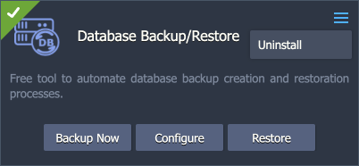

# Database Backup/Restore Add-On

Database Backup Add-On is compatible with multiple database solutions in the Virtuozzo Application Platform. It works in tandem with [Backup Storage](https://github.com/jelastic-jps/backup-storage) to help users automatically create and store database backups at the remote storage. The list of supported web applications:

- MySQL/MariaDB/Percona
- PostgreSQL
- Redis

As a backup software the [Restic](https://restic.net/) is used.

Restic is a program to make a security copy for free and fast. It is a secure, cross-platform, open source program written in the Go programming language.

Restic encrypts data using AES-256 and authenticates it using Poly1305-AES. Backing up is incremental process and is based on snapshotting of the specific directory or even the whole server that makes the process is really fast.

## Pre-Requirements

Before starting the add-on installation, you need to create a dedicated storage instance to keep all the backup data.

1\. If you don’t have one, it can be created in a few minutes using the dedicated **Backup Storage** package in the [platform Marketplace](https://www.virtuozzo.com/application-platform-docs/marketplace/).

If you already have such storage, you can skip this section.

2\. Within the installation window, you can choose between the ***Standalone*** and ***Cluster*** storage options. Next, specify the preferred **Number of nodes** (for Cluster option) and **Storage size**. Finalize by providing the standard data:

- **Environment** – environment domain name
- **Display Name** – [environment's alias](https://www.virtuozzo.com/application-platform-docs/environment-aliases/)
- **Region** – [environment's region](https://www.virtuozzo.com/application-platform-docs/environment-regions/) (if multiple ones are available)

3\. Click the Install button and wait several minutes for the storage to be created. It will be automatically added to the “*Backup storage nodes*” [group](https://www.virtuozzo.com/application-platform-docs/environment-groups/).

> **Tip:** One storage can be used by as many databases as needed.

## Add-On Installation

1\. Once the storage is ready, you can install the backup add-on. Hover over your database and click the **Add-Ons** icon.

Locate the required ***Database Backup/Restore Add-On*** and click **Install**.

2\. Provide the following data:

- Choose scheduling option
  - **Pre-defined** – select from a list of standard backup intervals (hourly, daily, weekly, monthly)
  - **Custom** – choose the exact Time, required Days of the week, and Time Zone

  - **Manual (crontab)** - provide a simple [cron-based expression](https://en.wikipedia.org/wiki/Cron#Overview) (using the UTC zone) to schedule backups

- **Backup storage** – choose from the list of the backup storages installed on the account
- **Number of backups** – set the number of the newest backups to keep for the current database
- **Database User** and **Database Password** – provide user credentials to access the database

3\. In a minute, you’ll see the installation success pop-up.

Your backup add-on is already working. Just wait for the specified time for backups to be created.

## Managing Add-On

After the installation, the add-on gives you the options to:

- **Backup Now** – creates an immediate backup
- **Configure** – adjusts parameters specified during the creation (schedule, storage node, quantity of backups, user credentials)
- **Restore** – restores from backup
- **Uninstall** – removes the backup add-on

## Restoring Database

*Database restoration from the backup overrides all the existing data. Any recent changes that were made since the backup creation will be permanently lost.*

In order to restore a database from a backup, you need to select the **Restore** option for the add-on. A dialogue window with the following options will be opened:

- **Restore from** – choose the target environment (multiple options may be available if the backup add-on is used on several environments)
- **Backup** – select from a list of backups for the selected environment (names contain timestamps for quick identification)

Click **Restore** and confirm via pop-up. Once initiated, the action cannot be canceled or reverted. You'll see the success notification in the dashboard after the process completion.